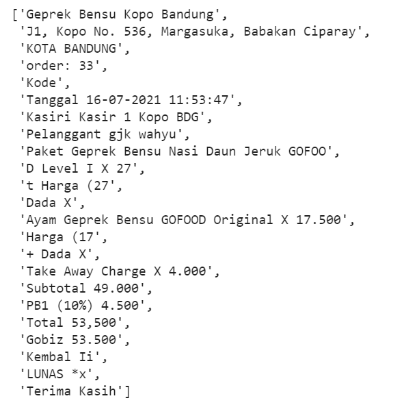

# Optical Character Recognition for Receipt

## Sample Results
Input Image             |  Output
:----------------------:|:----------------------:
  |  

## References:

| Title                                                                                   | Author           | Year | Github | Paper |
| ----------------------------------------------------------------------------------------| ---------------- | ---- | --------- | ----- | 
| Character Region Awareness for Text Detection                                           | Clova AI Research, NAVER Corp.| 2019 | https://github.com/clovaai/CRAFT-pytorch | https://arxiv.org/abs/1904.01941 |
| What Is Wrong With Scene Text Recognition Model Comparisons? Dataset and Model Analysis | Clova AI Research, NAVER Corp.| 2019 | https://github.com/clovaai/deep-text-recognition-benchmark | https://arxiv.org/abs/1904.01906 |

## Folder structure
```
.
├─ configs               
|  ├─ craft_config.yaml  
|  └─ star_config.yaml   
├─ data
|  ├─ sample_output.jpg  
|  └─ tes.jpg
├─ notebooks                          
|  ├─ export_onnx_model.ipynb         
|  ├─ inference_default_engine.ipynb  
|  ├─ inference_onnx_engine.ipynb     
|  └─ test_api.ipynb                  
├─ src                                                               
|  ├─ text_detector                                         
|  │  ├─ basenet                                           
|  │  │  ├─ __init__.py                           
|  │  │  └─ vgg16_bn.py                           
|  │  ├─ modules                                              
|  │  │  ├─ __init__.py                           
|  │  │  ├─ craft.py                              
|  │  │  ├─ craft_utils.py                        
|  │  │  ├─ imgproc.py                            
|  │  │  ├─ refinenet.py                          
|  │  │  └─ utils.py                              
|  │  ├─ __init__.py                              
|  │  ├─ infer.py                                 
|  │  └─ load_model.py                            
|  ├─ text_recognizer                                           
|  │  ├─ modules                                              
|  │  │  ├─ dataset.py                            
|  │  │  ├─ feature_extraction.py                 
|  │  │  ├─ model.py                              
|  │  │  ├─ model_utils.py                        
|  │  │  ├─ prediction.py                         
|  │  │  ├─ sequence_modeling.py                  
|  │  │  ├─ transformation.py                     
|  │  │  └─ utils.py                              
|  │  ├─ __init__.py                              
|  │  ├─ infer.py                                 
|  │  └─ load_model.py                            
|  ├─ __init__.py                                 
|  ├─ engine.py                                   
|  └─ model.py                                    
├─ .gitignore
├─ Dockerfile
├─ environment.yaml
├─ LICENSE
├─ main.py
├─ pyproject.toml
├─ README.md
├─ requirements.txt
├─ setup.cfg
```

## Requirements:
You can setup the environment using conda or pip
```
pip install -r requirements.txt
```
or
```
conda env create -f environment.yaml
```

## Container
```
docker build -t receipt-ocr . 
```

## Creator
[](https://github.com/rubentea16)